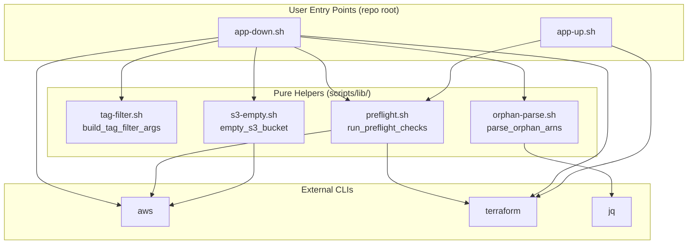
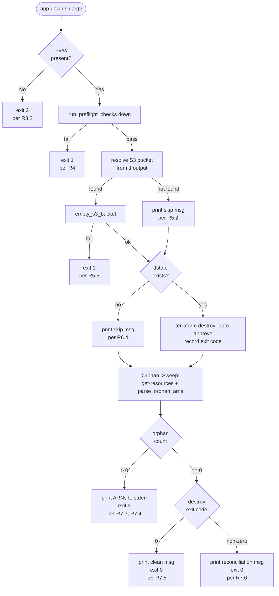
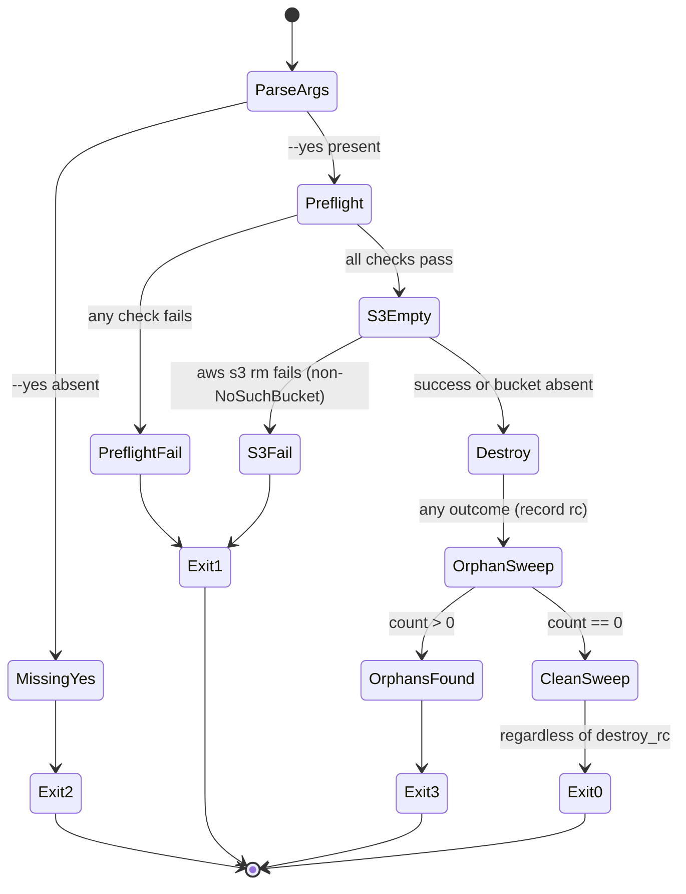

# Design Document: App Lifecycle Scripts

## Overview

This design specifies two top-level shell scripts — `app-up.sh` and `app-down.sh` — that wrap the existing Terraform configuration under `terraform/` to give the DevOps Agent Demo Store a predictable, single-command deploy and teardown experience. The scripts are composed from small, pure, testable bash helpers under `scripts/lib/`. All safety-critical logic (tag-filter construction, orphan-list parsing, pre-flight checks, and the `--yes` confirmation gate) lives in these helpers, where it is covered by TypeScript + Vitest + fast-check tests that shell out to bash through `child_process.spawnSync`.

Four cross-cutting safety guarantees drive the design:

1. **Tag-scope safety (per R8).** Every AWS resource destruction goes through `terraform destroy`, which operates on the Terraform state, or through S3 object-emptying on a bucket whose identity is sourced from Terraform state. The scripts NEVER call `aws ec2 terminate-instances`, `aws rds delete-db-instance`, or any similar direct delete API. The tag filter used by the orphan-sweep validation is a **hardcoded constant string** built by `build_tag_filter_args` with no variable interpolation, so ambient environment variables cannot widen or alter the scope.

2. **Fail-closed pre-flight (per R2, R4).** Both scripts run a fixed battery of pre-flight checks (aws CLI present, terraform CLI present, credentials valid, account ID matches `684394110906`) before touching any mutating command. Any failing check terminates the script with a non-zero exit code, and the pre-flight orchestrator never emits the sentinel "proceed" signal that downstream stages would rely on.

3. **`--yes` confirmation gate (per R3).** `app-down.sh` must be invoked with the literal argument `--yes`. Without it, the script exits with status 2 before loading any helper, reading any config, or spawning any subprocess that could call AWS. This puts the gate at the earliest possible point in the script so it cannot be bypassed by a later code path.

4. **Orphan sweep as an independent validator (per R7).** After `terraform destroy` runs, the script queries `aws resourcegroupstaggingapi get-resources` with the hardcoded tag filter and reports any remaining resources. The orphan sweep is a **verifier, not a destroyer** — it only reads, never deletes. If it finds orphans, the script exits with status 3 and prints each ARN; remediation is a manual user action, never an automatic second-round destroy.

These four guarantees are encoded in the design as formal correctness properties (P1–P4, see Correctness Properties below) and are enforced both by tests and by the script structure (ordering, sourcing discipline, hardcoded constants).

## Glossary

Terms below are used throughout the design and match the glossary in `requirements.md`.

- **App_Up_Script** — The executable shell script at `app-up.sh` in the repository root. Runs pre-flight checks and invokes `terraform apply`.
- **App_Down_Script** — The executable shell script at `app-down.sh` in the repository root. Runs pre-flight checks, empties the S3 frontend bucket, runs `terraform destroy`, and runs the orphan sweep.
- **Project_Tag** — AWS tag `Project=devops-demo`, stamped on every resource by the Terraform provider's `default_tags`.
- **ManagedBy_Tag** — AWS tag `ManagedBy=terraform`, stamped on every resource by `default_tags`.
- **Target_Resource** — Any AWS resource in the Configured_Region carrying BOTH Project_Tag AND ManagedBy_Tag (AND, not OR).
- **Orphan_Sweep** — The read-only post-destroy validation that queries `aws resourcegroupstaggingapi get-resources` for Target_Resources and reports any that still exist.
- **Terraform_State** — The `terraform.tfstate` file (local backend) in `terraform/`. A remote backend is out of scope for this feature.
- **AWS_Account** — The AWS account returned by `aws sts get-caller-identity`. The expected account is `684394110906`.
- **Configured_Region** — The AWS region sourced from `terraform/terraform.tfvars` (key `aws_region`), defaulting to `us-east-1`.
- **Tfvars_File** — The file at `terraform/terraform.tfvars`.
- **Tfvars_Example_File** — The template file at `terraform/terraform.tfvars.example`.
- **S3_Frontend_Bucket** — The S3 bucket created by `terraform/s3-frontend.tf` (resource `aws_s3_bucket.frontend`). Must be emptied before `terraform destroy` will succeed.
- **Pre_Flight_Check** — A synchronous, non-mutating verification that runs before any destructive command (tool presence, credential validity, account match).

## Architecture

The system decomposes into three layers:



The top-level scripts are thin orchestrators: they handle argv parsing, source the helpers, call them in a fixed order, and own the exit-code contract. The helpers are pure bash functions — each one is either deterministic given its arguments and stdin (`build_tag_filter_args`, `parse_orphan_arns`) or exercises a narrow, testable subset of AWS/Terraform CLI surface (`empty_s3_bucket`, the pre-flight checks).

Control flow for the teardown path (the more complex of the two) is:



Two structural rules flow from the diagram:

- The `--yes` gate is the first branch, before anything else is sourced or run.
- The orphan sweep is the final step and it always runs, even when `terraform destroy` failed — that's how R7.6 (destroy failed + clean sweep → success) is realized.

## Module/Helper Architecture

### scripts/lib/tag-filter.sh

Pure string-producing helper. Hardcodes the tag scope.

```
build_tag_filter_args()
  args:   none
  stdin:  unused
  stdout: "--tag-filters Key=Project,Values=devops-demo Key=ManagedBy,Values=terraform"
          (exactly one line, no trailing newline variation that would confuse callers)
  stderr: empty
  return: 0 always
  side effects: none
```

**Safety invariant.** The emitted string is a literal — no variable interpolation, no `$PROJECT_NAME`, no reading from tfvars. This is deliberate (see "Tag Scope Safety Model" below). Changing the project tag values in Terraform and not here will cause the orphan sweep to miss resources, which is a test-level concern enforced by P2.

### scripts/lib/orphan-parse.sh

Pure stdin-to-stdout JSON transformer.

```
parse_orphan_arns()
  args:   none
  stdin:  a JSON document produced by
          'aws resourcegroupstaggingapi get-resources --tag-filters ...'
          Shape: {"ResourceTagMappingList": [{"ResourceARN": "arn:...", "Tags": [...]}, ...]}
  stdout: one ResourceARN per line, in input order; no output for empty list
  stderr: empty on success; jq error output on malformed JSON
  return: 0 on success; non-zero if jq fails (malformed input)
  side effects: none; uses jq, no AWS/Terraform calls
```

Implementation uses `jq -r '.ResourceTagMappingList[].ResourceARN'`. The `jq` dependency is declared and enforced by a pre-flight check (see `preflight.sh`).

### scripts/lib/preflight.sh

Fail-closed pre-flight orchestrator.

```
check_aws_cli()
  args:   none
  stdout: empty
  stderr: exact error string from R2.2 (up) or R4.2 (down) on failure
  return: 0 if `aws` is on PATH; 1 otherwise
  side effects: none
check_terraform_cli(mode)
  args:   $1 = "up" | "down"
  stdout: in "up" mode with Darwin + brew, informational message
          about brew install attempt (if attempted)
  stderr: exact error string from R2.5 (up) or R4.4 (down) on failure
  return: 0 if terraform is on PATH after any auto-install attempt; 1 otherwise
  side effects: in "up" mode only, may run
                'brew tap hashicorp/tap && brew install hashicorp/tap/terraform'
                per R2.4. In "down" mode, never auto-installs (R4.4 requires
                terraform to be pre-installed for teardown safety).
check_aws_credentials(mode)
  args:   $1 = "up" | "down"
  stdout: empty
  stderr: exact error string from R2.7 (up) or R4.6 (down) on failure
  return: 0 if `aws sts get-caller-identity` exits 0; 1 otherwise
  side effects: one AWS API call (read-only GetCallerIdentity)
check_aws_account_id(mode)
  args:   $1 = "up" | "down"
  stdout: empty
  stderr: exact error string from R2.9 (up) or R4.8 (down) on failure,
          with <actual> substituted for the account ID returned
  return: 0 if returned account == EXPECTED_ACCOUNT_ID; 1 otherwise
  side effects: one AWS API call (GetCallerIdentity, may be cached with
                check_aws_credentials via a shared temp file)
check_jq()
  args:   none
  stderr: "ERROR: jq is required for JSON parsing. Install it and re-run."
          on failure
  return: 0 if jq is on PATH; 1 otherwise
  side effects: none
run_preflight_checks(mode)
  args:   $1 = "up" | "down"
  stdout: forwards informational messages from sub-checks
  stderr: forwards error messages from sub-checks
  return: 0 only if ALL of (check_aws_cli, check_terraform_cli $mode,
          check_aws_credentials $mode, check_aws_account_id $mode, check_jq)
          return 0. Returns the first non-zero code encountered, short-circuiting.
  side effects: those of the sub-checks; no mutating AWS or Terraform calls.
```

The expected account ID is defined as a readonly constant at the top of `preflight.sh`:

```
readonly EXPECTED_ACCOUNT_ID="684394110906"
```

This keeps the account-match check from relying on any caller-supplied value.

**Fail-closed contract.** `run_preflight_checks` returns early on the first failure and **never prints a "proceed" sentinel on failure**. Callers rely on the exit code, not on stdout content. This is the basis for property P4.

### scripts/lib/s3-empty.sh

S3-bucket-emptying helper for the versioning-enabled case.

```
empty_s3_bucket(bucket_name, region)
  args:   $1 = bucket name (without 's3://' prefix)
          $2 = AWS region
  stdout: progress lines ("Emptying bucket <name>...", object/version counts)
  stderr: failing aws command + its stderr on non-success (non-NoSuchBucket) failures
  return: 0 on success OR if bucket does not exist (NoSuchBucket is treated as
          success — an already-deleted bucket is a valid terminal state)
          non-zero on any other aws CLI failure
  side effects: deletes all current objects via `aws s3 rm s3://<b>/ --recursive`
                if versioning is enabled, also deletes all non-current object
                versions and delete markers via paginated
                `aws s3api list-object-versions` +
                `aws s3api delete-objects` (batches of up to 1000 per R5.4).
                The bucket itself is NOT deleted — that's `terraform destroy`'s job.
```

Bucket versioning is probed with `aws s3api get-bucket-versioning`; if the response contains `"Status": "Enabled"` or `"Status": "Suspended"` (suspended buckets can still hold existing versions), the version-cleanup loop runs.

### app-up.sh (top-level orchestrator)

```
app-up.sh (no arguments required)
  stdout: informational progress + terraform outputs (alb_dns_name,
          s3_website_url, sns_topic_arn) per R1.5
  stderr: error messages from preflight or terraform failures
  return: 0 on success
          1 if any pre-flight check fails
          non-zero terraform exit code if `terraform apply` fails (R1.6)
  high-level flow:
    1. source scripts/lib/preflight.sh
    2. run_preflight_checks up                      (R2.1–R2.9)
    3. copy tfvars from example if missing          (R2.10)
    4. cd terraform; terraform init if .terraform   (R1.3)
       does not exist
    5. terraform plan -detailed-exitcode            (R9.1)
       if exit code is 0 (no changes), print
       "No infrastructure changes required." and exit 0
       if exit code is 2 (changes pending), continue
       any other exit code is a failure
    6. terraform apply -auto-approve                (R1.4)
    7. on success, print labeled outputs            (R1.5)
    8. on failure, propagate exit code and print
       failing command to stderr                    (R1.6)
```

The script is a linear sequence — no early returns other than the exit-on-check-fail pattern, no loops. All branching lives inside the helpers.

### app-down.sh (top-level orchestrator)

```
app-down.sh --yes
  stdout: informational progress + clean-sweep message (R7.2)
  stderr: error messages, missing-flag message (R3.2), orphan ARN list (R7.3)
  return: 0 | 1 | 2 | 3  (see "Exit Code State Machine" below)
  high-level flow:
    1. parse argv — if '--yes' not present, exit 2 with R3.2 message
       (NO sourcing, NO subprocess spawning before this gate)
    2. source scripts/lib/preflight.sh
    3. run_preflight_checks down                    (R4.1–R4.8)
    4. source scripts/lib/s3-empty.sh
       resolve bucket name from `terraform output -raw s3_bucket_name`
       (R5.1); if unavailable, print R5.2 message and skip to step 6
    5. empty_s3_bucket <bucket> <region>            (R5.3–R5.5)
    6. if tfstate exists: terraform destroy -auto-approve, record
       exit code in $destroy_rc
       if tfstate does not exist: print R6.4 message, set $destroy_rc=0
    7. source scripts/lib/tag-filter.sh and orphan-parse.sh
       aws resourcegroupstaggingapi get-resources ... $(build_tag_filter_args)
         | parse_orphan_arns
       count lines → $orphan_count
    8. apply exit-code contract (see state machine below)
```

Argv parsing in step 1 is a literal `for arg in "$@"; do [[ "$arg" == "--yes" ]] && yes_flag=1; done` — no `getopt`, no fuzzy matching, no `--yes=1`, no `-y` shorthand. The argument must be exactly `--yes` to trip the gate. This matches property P3.

## Tag Scope Safety Model

The safety model rests on four mechanical invariants, each enforced by test.

**1. Tag filter is a hardcoded constant (R8.3, R10.1).** `build_tag_filter_args` contains no variable expansion. If a future contributor changes the Terraform project name, they must also change this constant — and property P2 (tested with fast-check against arbitrary environment variables) guarantees that changes to ambient state cannot drift the output.

Why not derive it from tfvars? Because a compromised or misconfigured tfvars file (empty `project_name`, or `project_name=""`) would silently widen the sweep's scope to "all resources with `ManagedBy=terraform`" across the account. Hardcoding removes that class of failure.

**2. No direct delete APIs (R8.2).** The scripts never call `aws ec2 terminate-instances`, `aws rds delete-db-instance`, `aws ec2 delete-volume`, `aws iam delete-role`, `aws s3api delete-bucket`, or any service-specific destructor. Every resource destruction is routed through `terraform destroy` (which respects the state and dependency graph) or through S3 object-emptying inside the S3_Frontend_Bucket (per the exception in R8.1). A grep-based test (see "Test Harness Architecture") enforces this by scanning `app-*.sh` and `scripts/lib/*.sh` for forbidden invocations and failing on any match.

**3. AND, not OR, on tag filters (R8.3).** The tag filter emitted by `build_tag_filter_args` is:

```
--tag-filters Key=Project,Values=devops-demo Key=ManagedBy,Values=terraform
```

The `aws resourcegroupstaggingapi get-resources` CLI treats multiple `--tag-filters` entries as AND-combined: a resource must match both. A resource carrying only `Project=devops-demo` (say, from a different tool that uses the same project name but not Terraform) will not be reported as an orphan. This is intentional — the Orphan_Sweep's scope is "resources this Terraform stack created," not "anything labeled Project=devops-demo."

**4. Orphan sweep is a verifier, not a destroyer.** The sweep queries the tagging API (read-only) and prints results. If orphans exist, the script exits 3 — it does not attempt a "cleanup" delete pass. Any second-round destructive action is a manual user decision, made with full context. This prevents the failure mode where a transient AWS issue leaves an orphan, the script "helpfully" deletes it, and a subsequent investigation discovers the orphan was actually a legitimately-shared resource that should not have been destroyed.

## Exit Code State Machine



Truth table for the final exit code, as a function of `(destroy_rc, orphan_count)`, assuming pre-flight and S3 emptying already succeeded:

| destroy_rc | orphan_count | exit code | stdout/stderr behavior                                                                 |
|------------|--------------|-----------|-----------------------------------------------------------------------------------------|
| 0          | 0            | 0         | print `Orphan sweep: 0 resources remain. Teardown complete.` to stdout (R7.2, R7.5)     |
| 0          | > 0          | 3         | print header + each ARN to stderr (R7.3, R7.4)                                          |
| non-zero   | 0            | 0         | print reconciliation message `terraform destroy reported errors but orphan sweep is clean; treating teardown as successful.` to stdout (R7.6) |
| non-zero   | > 0          | 3         | print header + each ARN to stderr (R7.3, R7.4); destroy_rc is effectively shadowed by the orphan-count signal |

Notes:

- Exit 1 is reserved for pre-flight failures and S3-emptying failures before `terraform destroy` runs. Once the teardown pipeline has reached `terraform destroy`, the exit code becomes a function of `(destroy_rc, orphan_count)` only.
- Exit 2 is reserved for "missing `--yes`" and nothing else.
- Exit 3 specifically signals "orphans remain" and only "orphans remain" — it is actionable: the user should inspect the printed ARN list.

## Test Harness Architecture

All tests for the bash code are written in TypeScript, run by Vitest, and invoke bash via `child_process.spawnSync`. This mirrors the existing pattern in `app/orders-service/src/routes.property.test.ts` and keeps the test infrastructure consistent across the repo.

### Layout

```
scripts/
  lib/
    tag-filter.sh
    orphan-parse.sh
    preflight.sh
    s3-empty.sh
    package.json              # vitest + fast-check + supertest versions matching orders-service
    vite.config.ts            # same shape as app/orders-service/vite.config.ts
    tsconfig.json             # matches orders-service tsconfig
    tag-filter.test.ts
    tag-filter.property.test.ts        # P2
    orphan-parse.test.ts
    orphan-parse.property.test.ts      # P1
    preflight.test.ts
    preflight.property.test.ts         # P4
    s3-empty.test.ts
    app-up.test.ts
    app-down.test.ts
    app-down.property.test.ts          # P3
    tag-scope.test.ts                  # grep-based safety audit
    test-helpers/
      make-stub-bin.ts                 # PATH-stub harness
      spawn-bash.ts                    # thin wrapper over spawnSync
```

### Shelling out to bash

The canonical invocation pattern for a helper test is:

```
spawnSync('bash', ['-c', 'source scripts/lib/<file>.sh && <function> <args>'], {
  input: stdinPayload,       // optional, for parse_orphan_arns
  env: { ...process.env, PATH: stubPath },
  encoding: 'utf8',
})
```

Assertions check `status`, `stdout`, and `stderr` separately. This lets the tests enforce things like "stderr must be empty on success" (Requirement 11.1) without conflating streams.

### PATH-stub harness

`scripts/lib/test-helpers/make-stub-bin.ts` provides:

```
makeStubBin({
  commands: {
    'aws':       { script: '#!/usr/bin/env bash\n...' },
    'terraform': { script: '#!/usr/bin/env bash\n...' },
    'brew':      { script: '#!/usr/bin/env bash\nexit 0' },
    'jq':        { passthrough: true },      // use real jq on PATH
  }
}) => { stubDir: string, callLogPath: string, cleanup: () => void }
```

It creates a tempdir, writes executable scripts for each entry, and returns a PATH fragment to prepend. The stub scripts write their argv + stdin to a shared `callLogPath` file (one line per invocation, JSON-encoded) so tests can assert on the call sequence. A test that wants to assert "app-down.sh called `terraform destroy` exactly once with `-auto-approve`" reads that log.

Stubs accept env vars to configure failure modes:

- `STUB_AWS_FAIL_GET_CALLER_IDENTITY=1` — make `aws sts get-caller-identity` exit non-zero
- `STUB_AWS_ACCOUNT_ID=<id>` — make it return a specific account ID
- `STUB_TERRAFORM_DESTROY_RC=<code>` — make `terraform destroy` exit with that code
- `STUB_S3_BUCKET_VERSIONING=Enabled|Suspended|<empty>` — control the probe response
- `STUB_ORPHAN_JSON_FILE=<path>` — file whose contents are returned for `get-resources`

This configuration-via-env keeps the stubs themselves static and the per-test variation in the test code.

### Call-log assertions

Tests assert against the `callLogPath` file rather than mocking individual functions. A typical assertion:

```
expect(readCallLog(callLogPath)).toEqual([
  { cmd: 'aws',       argv: ['sts', 'get-caller-identity'] },
  { cmd: 'terraform', argv: ['output', '-raw', 's3_bucket_name'], cwd: 'terraform' },
  { cmd: 'aws',       argv: ['s3', 'rm', 's3://.../',  '--recursive', '--region', 'us-east-1'] },
  { cmd: 'terraform', argv: ['destroy', '-auto-approve'], cwd: 'terraform' },
  { cmd: 'aws',       argv: ['resourcegroupstaggingapi', 'get-resources', '--region', 'us-east-1',
                              '--tag-filters', 'Key=Project,Values=devops-demo',
                                               'Key=ManagedBy,Values=terraform'] },
])
```

This gives the tests strong ordering and argument-level assertions without ever calling real AWS or Terraform.

### How property tests compose with the harness

Property tests use `fast-check` to generate:

- **P1 (orphan-parse round trip)** — arbitrary `{ResourceTagMappingList: Array<{ResourceARN: string, Tags: Array<{Key, Value}>}>}` objects with realistic ARN shapes (`arn:aws:<service>:<region>:<account>:<resource-id>`), piped through `parse_orphan_arns`, asserting line count equals array length.
- **P2 (tag-filter invariance)** — arbitrary environment-variable maps (including `PROJECT_NAME`, `AWS_REGION`, arbitrary pollution), running `build_tag_filter_args` under each, asserting stdout is always the exact expected string.
- **P3 (`--yes` gate)** — arbitrary argv arrays that do NOT contain the literal token `--yes`, asserting `app-down.sh` exits 2 and no sentinel file is created. A complementary property on argvs that DO contain `--yes` asserts the exit code is not 2.
- **P4 (pre-flight fail-closed)** — arbitrary success/failure combinations for (aws present, terraform present, creds valid, account matches), asserting `run_preflight_checks` exits non-zero whenever any flag is set to failure.

Each property test runs at least 100 iterations per fast-check default, matching the convention in `app/orders-service/src/routes.property.test.ts`.

## Correctness Properties


*A property is a characteristic or behavior that should hold true across all valid executions of a system — essentially, a formal statement about what the system should do. Properties serve as the bridge between human-readable specifications and machine-verifiable correctness guarantees.*

The four properties called out in the user request (P1–P4) are kept verbatim and three additional properties (P5–P7) surfaced during the prework analysis are added, each validating a distinct concern that is universal over its input space.

### Property 1: `parse_orphan_arns` round-trip (count invariant)

*For any* valid `aws resourcegroupstaggingapi get-resources` JSON response of the shape `{"ResourceTagMappingList": [...]}`, piping that JSON through `parse_orphan_arns` and counting the output lines SHALL yield a count equal to the length of the `ResourceTagMappingList` array, and each output line SHALL be the `ResourceARN` of the corresponding array element in input order.

**Validates: Requirements 10.3, 11.3**

### Property 2: `build_tag_filter_args` environment-independence

*For any* environment variable map (including arbitrary values for `PROJECT_NAME`, `AWS_REGION`, `AWS_PROFILE`, and any other pollution), invoking `build_tag_filter_args` SHALL produce stdout equal to the exact literal string `--tag-filters Key=Project,Values=devops-demo Key=ManagedBy,Values=terraform`.

**Validates: Requirements 8.3, 10.1**

### Property 3: `--yes` gate never allows destruction

*For any* argv array that does NOT contain the literal token `--yes` as one of its elements, invoking `app-down.sh` with that argv SHALL exit with status 2 and SHALL NOT spawn any subprocess that invokes `aws` or `terraform` (verified by asserting that a sentinel file which any stub binary would create on invocation remains absent).

**Validates: Requirements 3.2, 8.1, 8.2**

### Property 4: Pre-flight checks fail-closed

*For any* combination of sub-check outcomes over (`check_aws_cli`, `check_terraform_cli`, `check_aws_credentials`, `check_aws_account_id`, `check_jq`), if any sub-check returns non-zero, then `run_preflight_checks` SHALL return non-zero and SHALL NOT emit the sentinel "proceed" signal that downstream stages depend on.

**Validates: Requirements 2.1–2.9, 4.1–4.8**

### Property 5: Teardown exit code is fully determined by (destroy_rc, orphan_count)

*For any* pair `(destroy_rc, orphan_count)` where `destroy_rc` is any integer (0 or non-zero) and `orphan_count` is any non-negative integer, the final exit code of `app-down.sh --yes` — assuming pre-flight and S3 emptying succeeded — SHALL be 3 whenever `orphan_count > 0`, and 0 whenever `orphan_count == 0` (regardless of `destroy_rc`).

**Validates: Requirements 7.4, 7.5, 7.6**

### Property 6: S3 version-deletion batch size bound

*For any* list of object versions and delete markers of arbitrary length N, the sequence of `aws s3api delete-objects` calls issued by `empty_s3_bucket` SHALL contain only calls whose `Delete.Objects` array has length in the inclusive range [1, 1000], and the union of all objects across those calls SHALL equal the input list exactly.

**Validates: Requirement 5.4**

### Property 7: `terraform apply` exit code is propagated

*For any* non-zero exit code returned by `terraform apply`, `app-up.sh` SHALL exit with the same non-zero code and SHALL write the failing command string to standard error.

**Validates: Requirement 1.6**

## Error Handling

Error handling is anchored in three rules: error strings match the requirements verbatim; stderr and stdout are kept separate; and failures at every stage propagate their cause, not just a bare exit code.

**Pre-flight errors.** Each pre-flight check writes the exact error string listed in R2.2 / R2.5 / R2.7 / R2.9 (for `app-up.sh`) or R4.2 / R4.4 / R4.6 / R4.8 (for `app-down.sh`) to stderr and returns non-zero. The orchestrator `run_preflight_checks` propagates the first non-zero return, short-circuiting the remaining checks. Tests assert the exact byte sequence on stderr.

**`terraform apply` / `terraform destroy` failures.** For `app-up.sh`, `terraform apply` failure propagates the terraform exit code (R1.6). The failing command string `terraform apply` is printed to stderr before exit. For `app-down.sh`, `terraform destroy` failure is NOT immediately fatal — the orphan sweep still runs, and the final exit code is determined by the truth table. This is important: a partial destroy (e.g., RDS stuck in deleting state) can still produce a clean orphan sweep once AWS catches up, which R7.6 correctly treats as success.

**S3 emptying failures.** `empty_s3_bucket` treats a `NoSuchBucket` response as success (the terminal state is the same either way). Any other `aws` CLI failure during emptying — including `AccessDenied`, `InvalidBucketName`, and network errors — causes the helper to return non-zero. `app-down.sh` then exits 1 per R5.5, printing the failing `aws` command and its captured stderr. Since `app-down.sh` has not yet called `terraform destroy` at this point, the bucket is simply still there; the user can re-run once the underlying issue is fixed (R9.3 guarantees idempotency).

**Orphan-sweep `aws` call failures.** If the `aws resourcegroupstaggingapi get-resources` call itself fails (e.g., credentials expired between pre-flight and sweep), the script treats this as an orphan-sweep failure. It exits with a non-zero status equal to the `aws` exit code and prints the failing command to stderr. This is a narrower case than "orphans found" — it does NOT use exit code 3 (which specifically signals "orphans remain"). The user sees "aws ... exited with code N" and knows the sweep did not complete.

**jq parse failures.** If `parse_orphan_arns` receives malformed JSON (which would indicate an AWS API contract change or a broken stub in testing), `jq` exits non-zero, `parse_orphan_arns` propagates it, and `app-down.sh` treats it the same as an orphan-sweep failure (non-zero exit with the failing command on stderr). This is strictly more conservative than defaulting to "0 orphans" on parse failure — we never claim a clean teardown we can't actually verify.

**Argument-parsing errors.** Invalid argv to `app-down.sh` (anything not exactly `--yes` or an empty argv) produces the R3.2 error and exit 2. We do NOT validate or reject other tokens beyond checking for `--yes`; an argv like `--yes --foo` still passes the gate (`--yes` is present). This matches the requirements' focus on the presence of `--yes` rather than on strict argv parsing.

## Failure Modes

Explicit failure-mode handling, matching the cases in the user request.

### AWS credentials expired mid-operation

**Scenario.** Pre-flight `aws sts get-caller-identity` succeeds at T=0. At T=60s (during `terraform destroy`), the short-lived credentials expire.

**Behavior.** `terraform destroy` fails with an AWS auth error. `destroy_rc` becomes non-zero but the script continues to the orphan sweep. The sweep's `aws resourcegroupstaggingapi get-resources` call also fails with an auth error; we treat this as an orphan-sweep failure (per Error Handling above) and exit non-zero with the failing command on stderr. The user sees a clear "credentials expired" signal and re-runs after refreshing credentials. R9.3 guarantees the re-run re-attempts all three steps in order.

**Why not retry internally?** Silent retries would obscure the cause. Letting the user re-run with refreshed credentials is simpler and safer.

### S3 bucket emptying fails because another process is writing objects

**Scenario.** A CI job or developer is actively uploading to the S3 frontend bucket while `app-down.sh --yes` is running. Some objects are uploaded after `aws s3 rm --recursive` completes but before `terraform destroy` runs.

**Behavior.** `terraform destroy` will attempt to delete the bucket and fail with `BucketNotEmpty`. `destroy_rc` is non-zero. The orphan sweep then reports the bucket as an orphan (count > 0). Script exits 3 with the bucket ARN on stderr. The user sees the bucket listed and either waits for the write-contention to stop and re-runs (R9.3), or deletes the contending process manually.

**Why not re-run emptying inside the script?** A loop could race the writer indefinitely. Surfacing the error to the user is the correct stop condition.

### `terraform destroy` fails partway (leaves dangling resources)

**Scenario.** `terraform destroy` successfully deletes EC2 + RDS but fails on the VPC due to a non-Terraform ENI being attached.

**Behavior.** `destroy_rc` is non-zero. The orphan sweep runs and reports the remaining VPC, any subnets it contains, and the associated security groups (all tagged). Script exits 3 with the full ARN list. The user deletes the non-Terraform ENI and re-runs; R9.3 re-attempts and the subsequent orphan sweep is clean.

### Network partition between `terraform destroy` and orphan sweep

**Scenario.** The network connection drops after `terraform destroy` completes but before the orphan sweep call returns.

**Behavior.** The `aws resourcegroupstaggingapi get-resources` call fails. The script exits non-zero with the failing `aws` command on stderr. The user re-runs once connectivity returns; the second run's pre-flight catches any credential issues and the orphan sweep completes normally.

### jq not installed

**Scenario.** `jq` is not on `PATH`.

**Behavior.** Pre-flight `check_jq` detects this and exits 1 with `ERROR: jq is required for JSON parsing. Install it and re-run.` BEFORE any destructive action. This is why `check_jq` is part of `run_preflight_checks` for both `up` and `down` modes — even though only the `down` path uses `jq`, fail-closed behavior is simpler when the check is uniform across modes.

### brew not installed on macOS (app-up.sh)

**Scenario.** `terraform` is not installed, the host OS is Darwin, but Homebrew is also not installed.

**Behavior.** Per R2.5, `app-up.sh` exits 1 with `ERROR: terraform CLI is not installed and cannot be auto-installed on this platform. Install it from https://developer.hashicorp.com/terraform/downloads and re-run.` The detection is: `uname -s` returns `Darwin` AND `command -v brew` returns empty → fail. The auto-install path in R2.4 (brew tap + brew install) only runs when both conditions are true.

**Behavior on app-down.sh.** Per R4.4, the down script NEVER auto-installs terraform. A missing terraform is a hard failure for teardown — installing CLI tools is not something we want to do during a destructive operation, even on a developer laptop.

### Empty or malformed tfstate

**Scenario.** `terraform/terraform.tfstate` exists but is an empty file or corrupted JSON.

**Behavior.** `terraform destroy` will fail to load it and exit non-zero. `destroy_rc` is non-zero. The orphan sweep then reflects the true AWS state: if resources still exist, they're reported and exit is 3; if AWS is already clean (e.g., a previous partial destroy succeeded), the reconciliation path (R7.6) kicks in and exit is 0. The user can inspect the state file and either restore a backup or proceed with the orphan-sweep outcome.

## Integration with Existing Codebase

### Test suite integration

The new `scripts/lib/` directory gets its own `package.json` with Vitest and fast-check dependencies pinned to the versions used by `app/orders-service` (currently `vitest ^2.1.0`, `fast-check ^3.22.0`). The root `package.json` `scripts` section gains a `test:scripts` entry:

```
"test:scripts": "npm test --prefix scripts/lib -- --run"
```

And the aggregate `test` script is updated to include it:

```
"test": "npm run test:catalog && npm run test:orders && npm run test:scripts"
```

This keeps `npm test -- --run` as the single test entry point (R11.4) while adding the scripts/lib coverage. CI configuration (from the existing Git Workflow rule set) runs `npm test -- --run` on every push, so this integration is zero-config for CI.

The scripts/lib tests are deliberately in their own subproject (rather than colocated under `app/`) because they exercise bash files at the repo root (`app-up.sh`, `app-down.sh`), not application code. Keeping them separate avoids polluting the services' test runs with subprocess-heavy tests.

### Missing Terraform output

Requirement 5.1 directs `app-down.sh` to resolve the S3 bucket name via `terraform output -raw s3_bucket_name`, but `terraform/outputs.tf` currently does not define an `s3_bucket_name` output. The existing outputs are `alb_dns_name`, `s3_website_url`, `rds_endpoint`, and `sns_topic_arn`.

**Design decision.** Add a new output to `terraform/outputs.tf`:

```
output "s3_bucket_name" {
  description = "Name of the S3 bucket hosting the frontend (used by app-down.sh)"
  value       = aws_s3_bucket.frontend.id
}
```

This is done as part of the task that implements bucket-name resolution in `app-down.sh` (design consumer adds its own missing dependency). The fallback path in R5.1 (`terraform state show aws_s3_bucket.frontend`) still runs when the output is absent, so older state files without the output remain supported until the user re-applies.

### Existing bash scripts

The repo already has bash scripts at `app/orders-service/scripts/fault-inject.sh` and `fault-reset.sh`. The new scripts follow the same conventions observed there: `#!/usr/bin/env bash`, `set -euo pipefail` at the top, no `bash`-4-only features. The new scripts/lib helpers stay POSIX-leaning enough to run on Bash 3.2 (the default on macOS), avoiding `[[` with advanced pattern features, associative arrays, and `mapfile`/`readarray`.

### File tree additions

```
./
├── app-up.sh                     # NEW (executable)
├── app-down.sh                   # NEW (executable)
├── scripts/
│   └── lib/
│       ├── tag-filter.sh         # NEW
│       ├── orphan-parse.sh       # NEW
│       ├── preflight.sh          # NEW
│       ├── s3-empty.sh           # NEW
│       ├── package.json          # NEW
│       ├── vite.config.ts        # NEW
│       ├── tsconfig.json         # NEW
│       ├── *.test.ts             # NEW (see Test Harness Architecture)
│       ├── *.property.test.ts    # NEW
│       └── test-helpers/         # NEW
└── terraform/
    └── outputs.tf                # MODIFIED (add s3_bucket_name)
```

## Observability

The scripts' "observability" is the contents of stdout, stderr, and the exit code. Those three channels together must let a user debugging a failed run tell exactly what happened at each step.

**stdout** carries informational progress and success output:
- Pre-flight progress: `Checking aws CLI... ok`, `Checking terraform CLI... ok`, `Checking AWS credentials... ok`, `Checking AWS account... ok (684394110906)`.
- Tfvars copy notification (R2.10): `Copied terraform/terraform.tfvars.example to terraform/terraform.tfvars. Edit it if you need non-default values.`
- Terraform output (R1.5): `alb_dns_name: <value>`, `s3_website_url: <value>`, `sns_topic_arn: <value>`, each on its own labeled line.
- No-change notification (R9.1): `No infrastructure changes required.`
- S3 skip notification (R5.2): `No S3 frontend bucket found in Terraform state; skipping bucket emptying.`
- Destroy skip notification (R6.4): `No Terraform state found; skipping terraform destroy and running orphan sweep only.`
- Clean sweep (R7.2): `Orphan sweep: 0 resources remain. Teardown complete.`
- Reconciliation (R7.6): `terraform destroy reported errors but orphan sweep is clean; treating teardown as successful.`

**stderr** carries errors and warnings:
- All pre-flight error strings (exact text from R2.2, R2.5, R2.7, R2.9, R4.2, R4.4, R4.6, R4.8).
- S3 emptying failure (R5.5): the failing `aws` command on one line, followed by its captured stderr.
- Orphan list (R7.3): `Orphan sweep: <N> tagged resources still exist:` followed by each ARN on its own line.
- Missing `--yes` (R3.2): exact text.
- Terraform propagation (R1.6): the failing command (e.g., `terraform apply`).

**Exit code** carries the final verdict:
- 0 = success
- 1 = pre-flight failure or S3-emptying failure
- 2 = missing `--yes` (down only)
- 3 = orphans remain after destroy (down only)
- non-zero (other) = terraform apply failure (up only, propagated)

**Progress step labels.** Each major step prints a prefix line before its work begins. This lets a user reading a CI log instantly locate where a failure happened:

```
==> [1/5] Pre-flight checks
==> [2/5] Resolving S3 frontend bucket
==> [3/5] Emptying S3 bucket <name>
==> [4/5] terraform destroy
==> [5/5] Orphan sweep
```

A user seeing `==> [3/5] Emptying S3 bucket` followed by an error in stderr knows the failure was in the S3 stage before terraform ran. This is not required by any specific acceptance criterion but is a standard bash-scripting practice and costs nothing.

## Testing Strategy

The testing approach combines example-based tests for specific exit codes and exact strings, property-based tests for universal correctness guarantees, and a grep-based safety audit for the tag-scope invariant.

### Test types used

- **Example unit tests** (the bulk of the suite) — exact-string and exact-exit-code assertions for each acceptance criterion, using the PATH-stub harness to avoid real AWS/Terraform calls.
- **Property-based tests** (P1–P7) — fast-check-generated inputs run through the helpers or full scripts, asserting universal properties.
- **Grep-based safety audit** — a single test that runs `grep -nE '(ec2 terminate-instances|rds delete-db-instance|ec2 delete-volume|iam delete-role|s3api delete-bucket)' app-*.sh scripts/lib/*.sh` and asserts zero matches. This enforces R8.2 mechanically and catches a whole class of regression.

### Property-based testing applicability

PBT is appropriate here for the pure helpers (`build_tag_filter_args`, `parse_orphan_arns`) and for the argv-parsing and exit-code-contract logic of the top-level scripts. These are the parts with meaningful input variation and low per-run cost (subprocess spawn time dominates, which is on the order of milliseconds per iteration — running 100 iterations per property is cheap).

PBT is NOT appropriate for: verifying AWS API contract details (we mock those), verifying Terraform's own behavior (we mock that too), or verifying filesystem side effects beyond "did the stub get called." Those are integration concerns, not YOUR-code logic.

### Test configuration

- Each property test runs at least 100 iterations (fast-check default; matches `app/orders-service/src/routes.property.test.ts` convention).
- Each property test has a comment tag in the format `**Feature: app-lifecycle-scripts, Property N: <title>**` referencing the design doc property.
- Example tests use the `PATH`-stub harness to record call sequences; assertions are on the call-log JSON, not on AWS API responses.
- No test calls real AWS, real Terraform against real state, or real S3. The harness blocks this by prepending the stub directory to `PATH`.

### Unit/integration boundary

- Unit tests: pure helpers (`tag-filter.sh`, `orphan-parse.sh`), individual preflight checks.
- Integration-ish tests: `app-up.sh` and `app-down.sh` end-to-end under the stub harness. Still no real AWS, but they exercise the full argv → preflight → destroy → sweep pipeline and assert on the aggregate call log.
- True end-to-end (LocalStack or real AWS) is explicitly out of scope (see below); the stub harness gives us 90%+ of the confidence at a fraction of the cost.

## Out of Scope

Deferred to future specs. None of these are implemented by this feature.

- **Remote state backend (S3 + DynamoDB locking).** Terraform state stays local for now. A future spec can add S3+DynamoDB backend config and update `app-down.sh` to handle `terraform init -migrate-state` and locked-state edge cases.
- **Multi-region teardown.** The scripts operate on a single `Configured_Region`. A multi-region variant would extend `build_tag_filter_args` to loop over regions (or use a region-less sweep) and is a separate design concern.
- **`--dry-run` flag.** A future addition to both scripts could print the commands that would run without executing them. Useful for CI validation and for cautious first-time users.
- **Cost estimation before launch.** Integration with `infracost` or `aws pricing` to show estimated monthly spend before `terraform apply`.
- **LocalStack-based end-to-end testing.** A LocalStack integration would exercise real AWS API call patterns without a real account. Gated behind an env var (e.g., `LOCALSTACK_E2E=1`) so normal CI stays fast.
- **Auto-remediation of orphans.** The orphan sweep reports but does not delete. A future tool could take the orphan ARN list and propose targeted deletion commands, but that is a separate, high-risk feature with its own design and safety model.
- **Homebrew auto-install of `jq` or `aws` CLI.** The current design only auto-installs `terraform` on Darwin (per R2.4). Extending auto-install to other dependencies is deferred — pre-flight failure with a clear error message is the current UX for missing tools.

