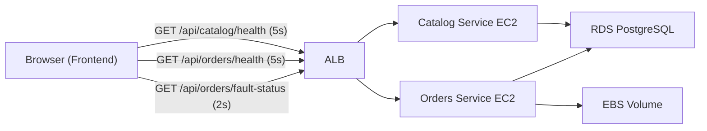
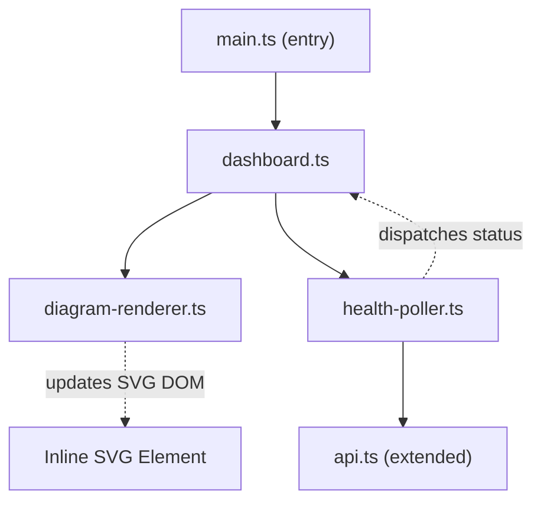

# Design Document: Architecture Health Dashboard

## Overview

The Architecture Health Dashboard adds a live, interactive SVG-based infrastructure diagram to the DevOps Demo Store frontend. The diagram visualizes the system topology (S3 → ALB → EC2 services → RDS / EBS) with real-time health status indicators and an EBS disk usage counter that updates during fault injection demos.

The feature spans three layers:

1. **Frontend** — New modules for SVG diagram rendering, health polling, and dashboard UI integration, all built with vanilla TypeScript and DOM manipulation (no framework).
2. **Backend** — A new `GET /api/orders/fault-status` endpoint on the Orders Service that exposes the current `FaultStatus` without triggering health check side effects.
3. **Infrastructure** — Terraform change to reduce the EBS volume from 20 GB to 2 GB so fault injection fills the disk faster.

### Design Rationale

- **Inline SVG via DOM manipulation** was chosen over an SVG library (e.g., D3, Snap.svg) to stay consistent with the project's vanilla TypeScript approach and avoid new dependencies.
- **Separate polling intervals** (5s for health, 2s for fault-status) reflect the different update frequencies needed: health status changes slowly, while disk usage during fault injection changes rapidly.
- **Collapsible section** keeps the dashboard unobtrusive when operators want to focus on the product grid.

## Architecture

### System Context



### Frontend Module Architecture



The frontend introduces three new modules:

| Module | Responsibility |
|---|---|
| `dashboard.ts` | Orchestrates initialization, wires poller callbacks to renderer updates, manages collapsible section |
| `diagram-renderer.ts` | Creates and updates the inline SVG diagram (nodes, edges, status indicators, EBS counter) |
| `health-poller.ts` | Manages polling intervals, fetches health/fault-status data, dispatches updates via callbacks |

### Data Flow

1. `main.ts` calls `initDashboard()` after DOM is ready.
2. `dashboard.ts` creates the dashboard section in the DOM, initializes the `DiagramRenderer`, and starts the `HealthPoller`.
3. `HealthPoller` fetches health endpoints at configured intervals and invokes callback functions with parsed data.
4. `dashboard.ts` receives callbacks and calls `DiagramRenderer` update methods to reflect new status on SVG nodes.
5. On page unload, `HealthPoller.stop()` clears all intervals.

## Components and Interfaces

### Backend: Fault Status Endpoint

A new route added to `app/orders-service/src/routes.ts`:

```typescript
/**
 * GET /api/orders/fault-status
 * Returns the current FaultStatus object as JSON.
 */
router.get('/api/orders/fault-status', async (_req: Request, res: Response, next: NextFunction) => {
  try {
    const mountPath = process.env.EBS_MOUNT_PATH ?? '/mnt/ebs-data';
    const status: FaultStatus = await getFaultStatus(mountPath);
    res.status(200).json(status);
  } catch (err) {
    res.status(500).json({
      error: err instanceof Error ? err.message : 'Failed to get fault status',
      code: 'FAULT_STATUS_ERROR',
    });
  }
});
```

This route must be registered before the `GET /api/orders/:id` catch-all route to avoid Express treating "fault-status" as an order ID.

### Frontend: API Extensions (`api.ts`)

Two new fetch wrappers added to the existing `api.ts`:

```typescript
import type { HealthCheck, FaultStatus } from '../../shared/types';

/** Fetch health status from the Catalog Service. */
export async function getCatalogHealth(): Promise<HealthCheck> {
  const response = await fetch(`${API_BASE_URL}/api/catalog/health`);
  if (!response.ok) throw new Error(`Catalog health failed: ${response.status}`);
  return response.json();
}

/** Fetch health status from the Orders Service. */
export async function getOrdersHealth(): Promise<HealthCheck> {
  const response = await fetch(`${API_BASE_URL}/api/orders/health`);
  if (!response.ok) throw new Error(`Orders health failed: ${response.status}`);
  return response.json();
}

/** Fetch fault injection status from the Orders Service. */
export async function getOrdersFaultStatus(): Promise<FaultStatus> {
  const response = await fetch(`${API_BASE_URL}/api/orders/fault-status`);
  if (!response.ok) throw new Error(`Fault status failed: ${response.status}`);
  return response.json();
}
```

### Frontend: HealthPoller (`health-poller.ts`)

```typescript
/** Configuration for the health poller. */
export interface HealthPollerConfig {
  healthIntervalMs: number;       // default: 5000
  faultStatusIntervalMs: number;  // default: 2000
  onCatalogHealth: (health: HealthCheck) => void;
  onOrdersHealth: (health: HealthCheck) => void;
  onFaultStatus: (status: FaultStatus) => void;
  onError: (service: string, error: Error) => void;
}

export interface HealthPoller {
  start(): void;
  stop(): void;
}

export function createHealthPoller(config: HealthPollerConfig): HealthPoller;
```

**Behavior:**
- `start()` initiates two `setInterval` loops: one for health endpoints (5s), one for fault-status (2s).
- Each loop calls the corresponding API function, then invokes the success callback or the `onError` callback.
- `stop()` calls `clearInterval` on both timers. Called on `beforeunload` event.
- On error, the poller continues polling at the configured interval (does not stop).

### Frontend: DiagramRenderer (`diagram-renderer.ts`)

```typescript
/** Health state for a single component node. */
export type NodeHealthState = 'healthy' | 'degraded' | 'unhealthy' | 'unknown';

/** The six component nodes in the architecture diagram. */
export type ComponentId = 's3' | 'alb' | 'catalog-ec2' | 'orders-ec2' | 'rds' | 'ebs';

export interface DiagramRenderer {
  /** Create the SVG element and append it to the container. */
  render(container: HTMLElement): void;
  /** Update the health status indicator for a component. */
  updateNodeStatus(componentId: ComponentId, status: NodeHealthState): void;
  /** Update the EBS disk usage percentage display. */
  updateEbsUsage(percent: number | null): void;
}

export function createDiagramRenderer(): DiagramRenderer;
```

**SVG Structure:**
- Root `<svg>` element with `viewBox="0 0 900 400"` and `preserveAspectRatio="xMidYMid meet"` for responsive scaling.
- `<defs>` section containing: arrowhead marker, drop shadow filter.
- Node groups (`<g>`) each containing: rounded `<rect>`, icon `<text>` (emoji or Unicode symbol), label `<text>`, status indicator `<circle>`.
- Edge paths (`<path>`) with smooth curves and arrowhead markers.

**Node Layout (left-to-right):**

| Node | Position (cx, cy) | Size (w × h) | Notes |
|---|---|---|---|
| S3 Frontend | (80, 200) | 120 × 80 | Far left |
| ALB | (260, 200) | 120 × 80 | Center-left |
| Catalog EC2 | (460, 120) | 120 × 80 | Center-top |
| Orders EC2 | (460, 280) | 120 × 80 | Center-bottom |
| RDS | (680, 120) | 120 × 80 | Right-top |
| EBS Volume | (680, 330) | 72 × 48 | 60% size, below-right of Orders EC2 |

**Status Indicator Colors:**
- `healthy` → `#28a745` (green)
- `degraded` → `#ffc107` (yellow)
- `unhealthy` → `#dc3545` (red)
- `unknown` → `#6c757d` (gray)

All color transitions use CSS `transition: fill 300ms ease`.

### Frontend: Dashboard Orchestrator (`dashboard.ts`)

```typescript
export interface Dashboard {
  /** Initialize the dashboard: create DOM, start polling. */
  init(): void;
  /** Tear down: stop polling, remove event listeners. */
  destroy(): void;
}

export function createDashboard(): Dashboard;
```

**Behavior:**
- `init()` creates a `<section>` element with heading "Architecture Health", a collapse toggle button, and a container `<div>` for the SVG.
- Inserts the section into the DOM between the header and `<main>`.
- Creates a `DiagramRenderer` and calls `render()` into the container.
- Creates a `HealthPoller` with callbacks that map API responses to renderer updates:
  - Catalog health → updates `catalog-ec2` node status + derives `rds` status from `details.database`.
  - Orders health → updates `orders-ec2` node status + derives `rds` and `ebs` status from `details.database` and `details.ebsVolume`.
  - Fault status → calls `updateEbsUsage(diskUsagePercent)`.
  - On error → sets the failing component to `unhealthy`.
- S3 and ALB nodes: S3 is always shown as `healthy` (if the page loaded, S3 is working). ALB is derived — `healthy` if at least one backend responds, `unhealthy` if both fail.
- Registers `beforeunload` listener to call `HealthPoller.stop()`.
- Collapse toggle hides/shows the SVG container with a CSS class.

### Frontend: HTML Changes (`index.html`)

No changes to `index.html` are needed. The dashboard section is created dynamically by `dashboard.ts` and inserted into the DOM via JavaScript.

### Frontend: CSS Additions (`styles.css`)

New styles added for the dashboard section:

```css
/* Architecture Health Dashboard */
.arch-dashboard { ... }
.arch-dashboard__header { ... }
.arch-dashboard__toggle { ... }
.arch-dashboard__content { ... }
.arch-dashboard__content.collapsed { display: none; }
.arch-dashboard svg { width: 100%; height: auto; }

/* Status indicator transition */
.status-indicator { transition: fill 300ms ease; }

/* EBS usage counter */
.ebs-usage { font-weight: 700; }
.ebs-usage--critical { fill: #dc3545; }
```

### Infrastructure: Terraform Change (`ec2-orders.tf`)

Single change to the `aws_ebs_volume.orders_data` resource:

```hcl
resource "aws_ebs_volume" "orders_data" {
  availability_zone = aws_subnet.private_a.availability_zone
  size              = 2    # Changed from 20 to 2
  type              = "gp3"
  encrypted         = true

  tags = {
    Name = "${var.project_name}-${var.environment}-orders-data"
  }
}
```

All other configuration (type, encryption, availability zone, tags) remains unchanged.

## Data Models

### Existing Types (no changes)

The feature relies on existing shared types with no modifications:

- **`HealthCheck`** — returned by `GET /api/catalog/health` and `GET /api/orders/health`
- **`HealthCheckStatus`** — `'healthy' | 'degraded' | 'unhealthy'`
- **`FaultStatus`** — returned by the new `GET /api/orders/fault-status` endpoint

### New Frontend Types

```typescript
/** Health state for diagram nodes, extending HealthCheckStatus with 'unknown'. */
type NodeHealthState = 'healthy' | 'degraded' | 'unhealthy' | 'unknown';

/** Identifiers for the six architecture diagram nodes. */
type ComponentId = 's3' | 'alb' | 'catalog-ec2' | 'orders-ec2' | 'rds' | 'ebs';

/** Configuration for a single node in the diagram. */
interface NodeConfig {
  id: ComponentId;
  label: string;
  icon: string;          // Unicode/emoji character
  x: number;
  y: number;
  width: number;
  height: number;
  hasStatusIndicator: boolean;
}

/** Configuration for an edge between two nodes. */
interface EdgeConfig {
  from: ComponentId;
  to: ComponentId;
  path: string;          // SVG path data (d attribute)
}
```

### API Response Shapes

**`GET /api/orders/fault-status` — 200 OK:**
```json
{
  "active": true,
  "startedAt": "2025-01-15T10:30:00.000Z",
  "volumePath": "/mnt/ebs-data",
  "diskUsagePercent": 45,
  "fioProcessRunning": true
}
```

**`GET /api/orders/fault-status` — 500 Error:**
```json
{
  "error": "Failed to read disk usage",
  "code": "FAULT_STATUS_ERROR"
}
```


## Correctness Properties

*A property is a characteristic or behavior that should hold true across all valid executions of a system — essentially, a formal statement about what the system should do. Properties serve as the bridge between human-readable specifications and machine-verifiable correctness guarantees.*

### Property 1: Node rendering includes label and icon

*For any* valid `NodeConfig` object with a non-empty `label` and `icon`, rendering that node should produce an SVG group containing a text element whose content matches the `label` and a text/symbol element whose content matches the `icon`.

**Validates: Requirements 1.3**

### Property 2: Status indicator color mapping

*For any* `ComponentId` that has a status indicator and *for any* `NodeHealthState` value (`'healthy'`, `'degraded'`, `'unhealthy'`, `'unknown'`), calling `updateNodeStatus(componentId, state)` should set the status indicator's fill color to the corresponding value: green (`#28a745`) for healthy, yellow (`#ffc107`) for degraded, red (`#dc3545`) for unhealthy, gray (`#6c757d`) for unknown.

**Validates: Requirements 2.2, 2.3, 2.4, 2.5**

### Property 3: EBS usage counter displays correct percentage text

*For any* integer `percent` in the range [0, 100], calling `updateEbsUsage(percent)` should set the EBS usage counter text content to `"{percent}%"`. When called with `null`, the text content should be `"—%"`.

**Validates: Requirements 3.1, 3.5**

### Property 4: EBS usage counter color follows 80% threshold

*For any* integer `percent` in the range [0, 100], after calling `updateEbsUsage(percent)`, the EBS usage counter text should have a red color class applied if and only if `percent > 80`.

**Validates: Requirements 3.3, 3.4**

### Property 5: Health poller dispatches correct health data

*For any* valid `HealthCheck` object (with any combination of `status`, `database`, and optional `ebsVolume` values), when the fetch mock returns that object for a health endpoint, the corresponding callback (`onCatalogHealth` or `onOrdersHealth`) should be invoked with an argument deeply equal to the original `HealthCheck` object.

**Validates: Requirements 4.3, 4.4**

### Property 6: Fault status poller dispatches correct fault data

*For any* valid `FaultStatus` object (with any `diskUsagePercent` in [0, 100], any `active` boolean, and any `volumePath` string), when the fetch mock returns that object for the fault-status endpoint, the `onFaultStatus` callback should be invoked with an argument deeply equal to the original `FaultStatus` object.

**Validates: Requirements 4.5**

### Property 7: Health poller error handling preserves polling

*For any* HTTP error status code (4xx or 5xx) or network error thrown by fetch for any health or fault-status endpoint, the `onError` callback should be invoked with the failing service name, and the polling intervals should remain active (not cleared).

**Validates: Requirements 4.6**

### Property 8: Collapse toggle alternates visibility

*For any* non-negative integer `n` representing the number of times the collapse toggle is clicked, the dashboard content should be visible when `n` is even and hidden when `n` is odd (starting from visible at `n = 0`).

**Validates: Requirements 8.5**

## Error Handling

### Backend: Fault Status Endpoint

| Scenario | HTTP Status | Response Body | Behavior |
|---|---|---|---|
| `getFaultStatus()` succeeds | 200 | `FaultStatus` JSON | Normal response |
| `getFaultStatus()` throws | 500 | `{ error: "<message>", code: "FAULT_STATUS_ERROR" }` | Error caught in route handler, not propagated to Express error middleware |
| Invalid mount path (env var missing) | 200 | `FaultStatus` with `diskUsagePercent: 0` | Falls back to default path `/mnt/ebs-data`; `getDiskUsage` returns 0 on failure |

### Frontend: Health Poller Error Handling

| Scenario | Behavior |
|---|---|
| Network error (fetch throws) | `onError` callback invoked with service name and error; component set to `unhealthy`; polling continues |
| Non-200 HTTP response | `onError` callback invoked; component set to `unhealthy`; polling continues |
| JSON parse error | Treated as network error — `onError` callback invoked; polling continues |
| All endpoints fail simultaneously | All service nodes set to `unhealthy`; ALB node set to `unhealthy`; polling continues |

### Frontend: Diagram Renderer Error Handling

| Scenario | Behavior |
|---|---|
| Container element is null | `render()` throws with descriptive error message |
| `updateNodeStatus` called with invalid ComponentId | No-op (silently ignored to avoid breaking the polling loop) |
| `updateEbsUsage` called with NaN | Displays "—%" (same as null/initial state) |

### Frontend: Dashboard Initialization

| Scenario | Behavior |
|---|---|
| Header element not found in DOM | Dashboard section appended to beginning of `<body>` as fallback |
| Dashboard `init()` called multiple times | Idempotent — second call is a no-op if already initialized |
| `beforeunload` fires | `HealthPoller.stop()` called, all intervals cleared |

## Testing Strategy

### Testing Approach

This feature uses a **dual testing approach**:

- **Property-based tests** verify universal properties across many generated inputs (status mappings, percentage formatting, data dispatch correctness, toggle behavior).
- **Unit tests** verify specific examples, edge cases, initial states, and structural correctness (SVG structure, DOM insertion, CSS transitions, interval configuration).
- **Integration tests** verify the backend endpoint wiring and response shapes.

### Property-Based Testing Configuration

- **Library**: [fast-check](https://github.com/dubzzz/fast-check) for TypeScript property-based testing
- **Runner**: Vitest (already configured in the project)
- **Minimum iterations**: 100 per property test
- **Tag format**: `Feature: architecture-health-dashboard, Property {N}: {title}`

Each correctness property from the design document maps to exactly one property-based test:

| Property | Test File | What It Generates |
|---|---|---|
| P1: Node label/icon | `diagram-renderer.property.test.ts` | Random `NodeConfig` objects with varying labels and icons |
| P2: Status color mapping | `diagram-renderer.property.test.ts` | Random `(ComponentId, NodeHealthState)` pairs |
| P3: EBS percentage text | `diagram-renderer.property.test.ts` | Random integers 0–100 and null |
| P4: EBS color threshold | `diagram-renderer.property.test.ts` | Random integers 0–100 |
| P5: Health data dispatch | `health-poller.property.test.ts` | Random `HealthCheck` objects with varying status/details |
| P6: Fault data dispatch | `health-poller.property.test.ts` | Random `FaultStatus` objects with varying percentages/flags |
| P7: Error handling | `health-poller.property.test.ts` | Random HTTP error codes (400–599) and network errors |
| P8: Toggle visibility | `dashboard.property.test.ts` | Random non-negative integers for click count |

### Unit Tests

| Test File | Coverage |
|---|---|
| `diagram-renderer.test.ts` | SVG structure (6 nodes, 6 edges), EBS node sizing (60%), arrowhead markers, drop shadows, rounded corners, viewBox responsiveness, initial gray indicators, initial "—%" counter, theme colors, node layout positions, CSS transition attribute |
| `health-poller.test.ts` | Interval configuration (5s health, 2s fault-status), stop() clears intervals, beforeunload cleanup, immediate first poll on start |
| `dashboard.test.ts` | DOM insertion position (between header and main), heading text "Architecture Health", collapse toggle button exists, idempotent init, non-interference with existing elements |
| `api.test.ts` | New fetch wrappers: getCatalogHealth, getOrdersHealth, getOrdersFaultStatus — success and error responses |

### Backend Integration Tests

| Test File | Coverage |
|---|---|
| `routes.test.ts` (orders-service) | `GET /api/orders/fault-status` returns 200 with FaultStatus shape; returns 500 with error code on failure; route registered before `:id` catch-all |

### Infrastructure Verification

The Terraform change (EBS 20 GB → 2 GB) is verified by:
- Manual review of the `terraform plan` output before apply
- Confirming only the `size` field changed in `aws_ebs_volume.orders_data`

### Test Dependencies

New dev dependency needed in `app/frontend/package.json`:
```json
"fast-check": "^3.22.0"
```

New dev dependency needed in `app/orders-service/package.json` (if property tests are added for the endpoint):
```json
"fast-check": "^3.22.0"
```
