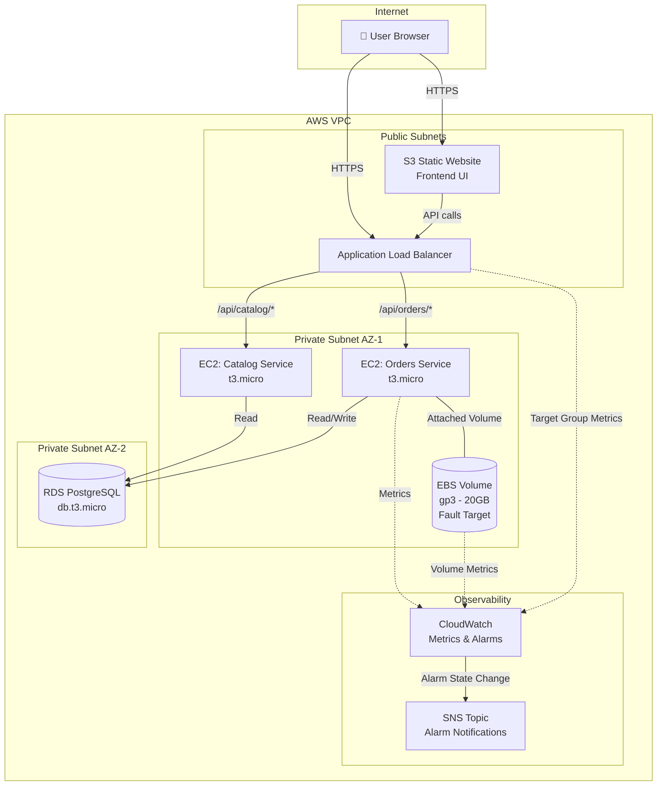
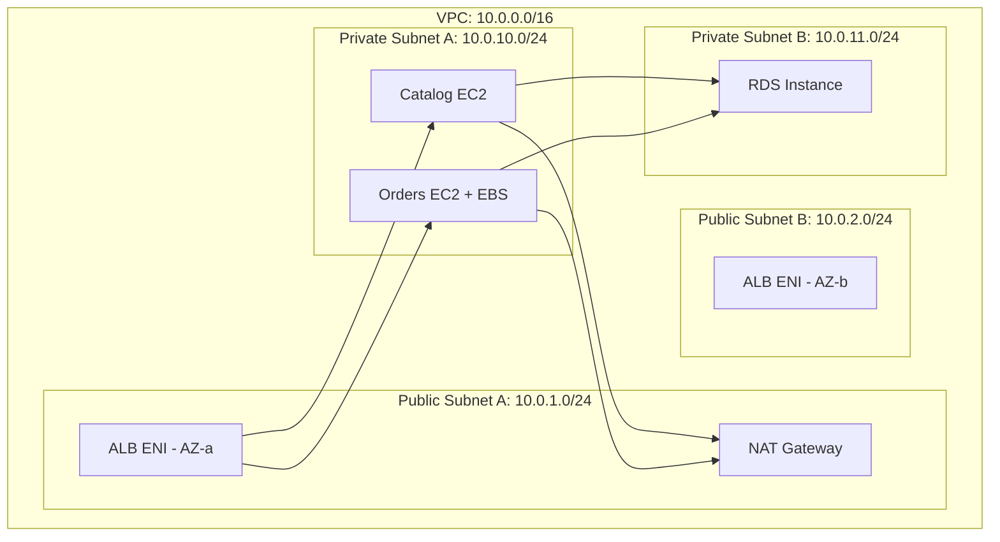
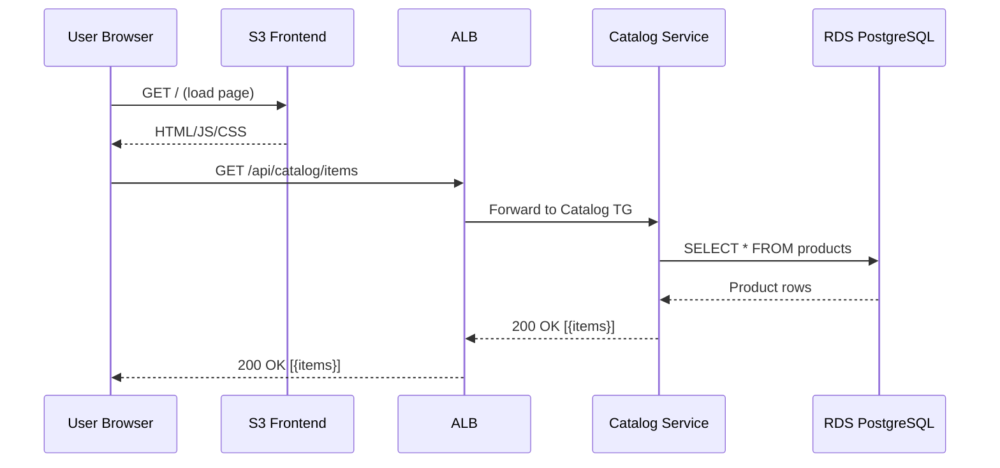
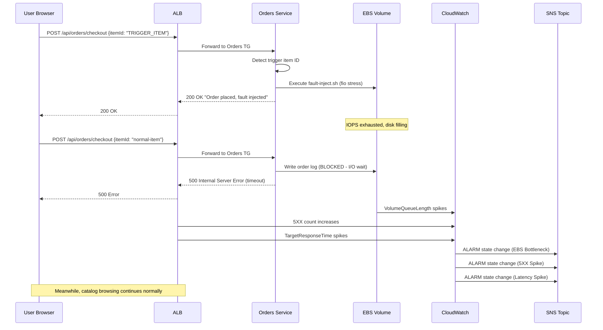
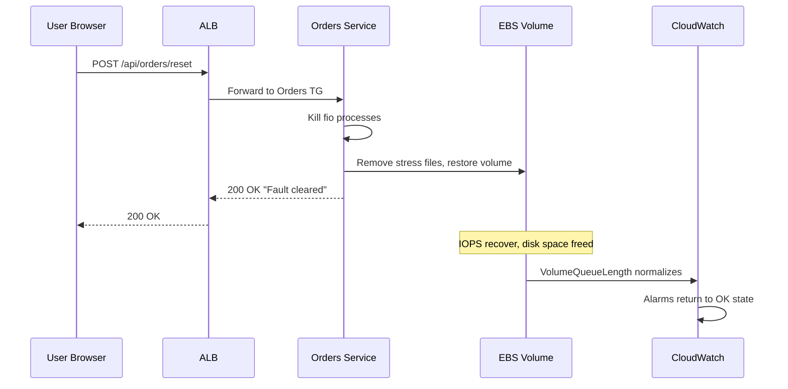

# Design Document: DevOps Agent Demo Environment

## Overview

This design describes an AWS-based demo environment for a dummy e-commerce platform built on a microservices architecture. The platform consists of a Web Tier (static frontend), an Application Load Balancer for routing, two backend services (Catalog Service and Orders Service) running on EC2 instances, and an RDS database for persistent storage. The Orders Service EC2 instance has a dedicated EBS volume that serves as the fault injection target.

The core purpose of this environment is to demonstrate localized failure isolation. When a user clicks "Buy" on a specific trigger item, the Orders Service initiates an EBS volume degradation script (using `fio` or `dd`) that exhausts IOPS on the attached volume. This causes the Orders Service to return HTTP 500 errors and experience high latency, while the Catalog Service continues operating normally. CloudWatch alarms on EBS metrics, ALB 5XX counts, and API latency detect the degradation and route alarm state changes to an SNS topic for downstream consumption by a DevOps agent (not part of this deliverable).

All infrastructure is defined in Terraform (HCL). Application code for the backend services and frontend is written in TypeScript. The environment is designed for single-region deployment with minimal cost footprint suitable for demo purposes.

## Architecture

### High-Level System Architecture



### Network Architecture



## Sequence Diagrams

### Normal Flow: Browse Catalog



### Fault Injection Flow: Buy Trigger Item



### Fault Recovery Flow



## Components and Interfaces

### Component 1: Frontend (S3 Static Site)

**Purpose**: Serves a simple e-commerce UI that displays products and allows "Buy" actions.

**Interface**:
```typescript
// Frontend makes these API calls to the ALB
interface CatalogApi {
  getItems(): Promise<Product[]>;
  getItemById(id: string): Promise<Product>;
}

interface OrdersApi {
  checkout(request: CheckoutRequest): Promise<CheckoutResponse>;
  getOrderStatus(orderId: string): Promise<OrderStatus>;
  resetFault(): Promise<ResetResponse>;
}
```

**Responsibilities**:
- Render product grid from Catalog API
- Send checkout requests to Orders API
- Display order success/failure states
- Provide a "Reset Fault" admin button for demo control

### Component 2: Catalog Service (EC2)

**Purpose**: Serves product catalog data. Must remain healthy during fault injection.

**Interface**:
```typescript
// Express.js routes
interface CatalogRoutes {
  'GET /api/catalog/items': () => Promise<Product[]>;
  'GET /api/catalog/items/:id': (id: string) => Promise<Product>;
  'GET /api/catalog/health': () => Promise<HealthCheck>;
}
```

**Responsibilities**:
- Query RDS for product data
- Return product listings and details
- Expose health check endpoint for ALB target group
- Operate independently of Orders Service

### Component 3: Orders Service (EC2 + EBS)

**Purpose**: Handles checkout operations and hosts the fault injection mechanism.

**Interface**:
```typescript
// Express.js routes
interface OrdersRoutes {
  'POST /api/orders/checkout': (body: CheckoutRequest) => Promise<CheckoutResponse>;
  'GET /api/orders/:id': (id: string) => Promise<Order>;
  'GET /api/orders/health': () => Promise<HealthCheck>;
  'POST /api/orders/reset': () => Promise<ResetResponse>;
}
```

**Responsibilities**:
- Process checkout requests against RDS
- Detect the trigger item ID and execute fault injection script
- Write order logs to the attached EBS volume (making it dependent on EBS health)
- Expose health check and fault reset endpoints

### Component 4: Fault Injection Script

**Purpose**: Degrades the attached EBS volume to simulate real-world storage failure.

**Interface**:
```typescript
// Shell script executed by Orders Service
interface FaultInjectionScript {
  inject(volumeMountPath: string): Promise<void>;
  reset(volumeMountPath: string): Promise<void>;
  status(volumeMountPath: string): Promise<FaultStatus>;
}
```

**Responsibilities**:
- Use `fio` to exhaust IOPS on the EBS volume
- Use `dd` to fill disk to near-capacity
- Provide a clean reset mechanism (kill processes, remove files)
- Report current fault status

### Component 5: CloudWatch Observability Stack

**Purpose**: Monitors infrastructure and application health, triggers alarms on degradation.

**Responsibilities**:
- Collect 1-minute detailed metrics from EC2 and EBS
- Evaluate alarm thresholds for EBS queue length, ALB 5XX count, and API latency
- Publish alarm state changes to SNS topic
- Provide dashboard for visual monitoring during demo

## Data Models

### Product

```typescript
interface Product {
  id: string;           // UUID, "TRIGGER_ITEM" for the fault trigger
  name: string;
  description: string;
  price: number;        // cents, integer
  imageUrl: string;
  category: string;
  isTrigger: boolean;   // true for the fault-injection item
}
```

**Validation Rules**:
- `id` must be non-empty string
- `price` must be positive integer
- `isTrigger` is exactly one product in the catalog (seeded at deploy time)

### Order

```typescript
interface Order {
  id: string;           // UUID
  productId: string;
  quantity: number;
  totalPrice: number;   // cents
  status: OrderStatus;
  createdAt: string;    // ISO 8601
}

type OrderStatus = 'pending' | 'confirmed' | 'failed';
```

### CheckoutRequest / CheckoutResponse

```typescript
interface CheckoutRequest {
  itemId: string;
  quantity: number;
}

interface CheckoutResponse {
  orderId: string;
  status: OrderStatus;
  message: string;
  faultInjected?: boolean;  // true when trigger item purchased
}
```

### HealthCheck

```typescript
interface HealthCheck {
  service: string;
  status: 'healthy' | 'degraded' | 'unhealthy';
  timestamp: string;
  details: {
    database: boolean;
    ebsVolume?: boolean;  // Orders Service only
  };
}
```

### FaultStatus

```typescript
interface FaultStatus {
  active: boolean;
  startedAt?: string;
  volumePath: string;
  diskUsagePercent: number;
  fioProcessRunning: boolean;
}
```

### CloudWatch Alarm Configuration

```typescript
interface AlarmConfig {
  name: string;
  metric: string;
  namespace: string;
  statistic: string;
  period: number;         // seconds
  evaluationPeriods: number;
  threshold: number;
  comparisonOperator: string;
  dimensions: Record<string, string>;
  alarmActions: string[]; // SNS topic ARNs
  okActions: string[];
}
```

### Database Schema (RDS PostgreSQL)

```sql
-- Products table (seeded at deploy time)
CREATE TABLE products (
  id VARCHAR(36) PRIMARY KEY,
  name VARCHAR(255) NOT NULL,
  description TEXT,
  price INTEGER NOT NULL CHECK (price > 0),
  image_url VARCHAR(512),
  category VARCHAR(100),
  is_trigger BOOLEAN DEFAULT FALSE
);

-- Orders table
CREATE TABLE orders (
  id VARCHAR(36) PRIMARY KEY,
  product_id VARCHAR(36) REFERENCES products(id),
  quantity INTEGER NOT NULL CHECK (quantity > 0),
  total_price INTEGER NOT NULL,
  status VARCHAR(20) DEFAULT 'pending',
  created_at TIMESTAMP DEFAULT CURRENT_TIMESTAMP
);

-- Seed the trigger item
INSERT INTO products (id, name, description, price, image_url, category, is_trigger)
VALUES (
  'TRIGGER_ITEM',
  'Mystery Box of Chaos',
  'Buy this item to trigger a system failure demo',
  9999,
  '/images/mystery-box.png',
  'special',
  TRUE
);
```


## Algorithmic Pseudocode

### Algorithm 1: Checkout Request Handler

```typescript
// Orders Service — POST /api/orders/checkout
async function handleCheckout(req: CheckoutRequest): Promise<CheckoutResponse> {
  // PRECONDITIONS:
  //   req.itemId is non-empty string
  //   req.quantity is positive integer
  //   Database connection is available

  // Step 1: Validate input
  if (!req.itemId || req.quantity <= 0) {
    throw new ValidationError('Invalid checkout request');
  }

  // Step 2: Look up product
  const product = await db.query<Product>(
    'SELECT * FROM products WHERE id = $1',
    [req.itemId]
  );
  if (!product) {
    throw new NotFoundError(`Product ${req.itemId} not found`);
  }

  // Step 3: Create order record
  const order: Order = {
    id: generateUUID(),
    productId: req.itemId,
    quantity: req.quantity,
    totalPrice: product.price * req.quantity,
    status: 'pending',
    createdAt: new Date().toISOString(),
  };

  // Step 4: Write order to database
  await db.query(
    'INSERT INTO orders (id, product_id, quantity, total_price, status) VALUES ($1,$2,$3,$4,$5)',
    [order.id, order.productId, order.quantity, order.totalPrice, order.status]
  );

  // Step 5: Write order log to EBS volume (this is the I/O dependency)
  await writeOrderLog(order, EBS_MOUNT_PATH);

  // Step 6: Check if this is the trigger item
  if (product.isTrigger) {
    await executeFaultInjection(EBS_MOUNT_PATH);
    return {
      orderId: order.id,
      status: 'confirmed',
      message: 'Order placed successfully. Fault injection activated.',
      faultInjected: true,
    };
  }

  // Step 7: Confirm order
  await db.query('UPDATE orders SET status = $1 WHERE id = $2', ['confirmed', order.id]);

  return {
    orderId: order.id,
    status: 'confirmed',
    message: 'Order placed successfully.',
  };

  // POSTCONDITIONS:
  //   Order record exists in database
  //   Order log written to EBS volume (or I/O error if volume degraded)
  //   If trigger item: fault injection process started on EBS volume
  //   If normal item: order status updated to 'confirmed'
}
```

**Preconditions:**
- `req.itemId` is a non-empty string
- `req.quantity` is a positive integer
- Database connection pool is available and healthy
- EBS volume is mounted at `EBS_MOUNT_PATH`

**Postconditions:**
- An order record exists in the `orders` table
- An order log entry was written (or attempted) to the EBS volume
- If `product.isTrigger === true`: `fio` process is running against EBS volume
- If `product.isTrigger === false`: order status is `'confirmed'`
- Response contains the order ID and current status

**Loop Invariants:** N/A (no loops in this algorithm)

### Algorithm 2: Fault Injection Execution

```typescript
// Fault injection — runs on Orders EC2 instance
async function executeFaultInjection(mountPath: string): Promise<void> {
  // PRECONDITIONS:
  //   mountPath is a valid mounted EBS volume path
  //   fio is installed on the EC2 instance
  //   Current user has write permissions to mountPath

  // Step 1: Check if fault is already active
  const status = await getFaultStatus(mountPath);
  if (status.active) {
    return; // Idempotent — don't stack faults
  }

  // Step 2: Launch fio to exhaust IOPS (background process)
  const fioCommand = [
    'fio',
    '--name=ebs-stress',
    '--ioengine=libaio',
    '--rw=randwrite',
    '--bs=4k',
    '--direct=1',
    '--numjobs=8',
    '--iodepth=64',
    `--directory=${mountPath}`,
    '--size=2G',
    '--time_based',
    '--runtime=3600',  // Run for 1 hour max
  ].join(' ');

  execDetached(`nohup ${fioCommand} &`);

  // Step 3: Fill disk with large file (parallel attack vector)
  execDetached(`nohup dd if=/dev/zero of=${mountPath}/fill.dat bs=1M count=15000 &`);

  // Step 4: Record fault start time
  await writeFile(`${mountPath}/.fault-active`, new Date().toISOString());

  // POSTCONDITIONS:
  //   fio process is running in background targeting mountPath
  //   dd process is filling disk at mountPath
  //   .fault-active marker file exists at mountPath
}
```

**Preconditions:**
- `mountPath` is a valid, mounted filesystem path (the EBS volume)
- `fio` binary is installed and available in PATH
- Process has write permissions to `mountPath`
- No existing fault injection is active (idempotent check)

**Postconditions:**
- `fio` process running with 8 jobs, 64 iodepth, random writes at 4K block size
- `dd` process writing zeros to fill available disk space
- `.fault-active` marker file created with timestamp
- EBS volume IOPS will be exhausted within seconds
- `VolumeQueueLength` metric will spike above threshold

**Loop Invariants:** N/A

### Algorithm 3: Fault Reset

```typescript
// Fault reset — POST /api/orders/reset
async function resetFault(mountPath: string): Promise<ResetResponse> {
  // PRECONDITIONS:
  //   mountPath is a valid mounted EBS volume path

  // Step 1: Kill all fio processes
  await exec('pkill -f "fio --name=ebs-stress" || true');

  // Step 2: Kill all dd fill processes
  await exec('pkill -f "dd if=/dev/zero" || true');

  // Step 3: Remove stress-generated files
  await exec(`rm -f ${mountPath}/ebs-stress.* ${mountPath}/fill.dat`);

  // Step 4: Remove fault marker
  await exec(`rm -f ${mountPath}/.fault-active`);

  // Step 5: Verify recovery
  const diskUsage = await getDiskUsage(mountPath);

  return {
    success: true,
    message: 'Fault injection cleared. Volume recovering.',
    diskUsagePercent: diskUsage,
  };

  // POSTCONDITIONS:
  //   No fio or dd processes running
  //   Stress files removed from volume
  //   .fault-active marker removed
  //   Disk usage returned to baseline
}
```

**Preconditions:**
- `mountPath` is a valid mounted filesystem path

**Postconditions:**
- All `fio` and `dd` stress processes are terminated
- All generated stress files (`ebs-stress.*`, `fill.dat`) are removed
- `.fault-active` marker file is removed
- Disk usage returns to pre-fault baseline within minutes
- CloudWatch alarms will transition back to OK state as metrics normalize

**Loop Invariants:** N/A

### Algorithm 4: EBS Volume Health Check

```typescript
// Health check for Orders Service — includes EBS volume status
async function checkOrdersHealth(mountPath: string): Promise<HealthCheck> {
  // PRECONDITIONS:
  //   mountPath is configured

  const health: HealthCheck = {
    service: 'orders',
    status: 'healthy',
    timestamp: new Date().toISOString(),
    details: { database: false, ebsVolume: false },
  };

  // Step 1: Check database connectivity
  try {
    await db.query('SELECT 1');
    health.details.database = true;
  } catch {
    health.status = 'unhealthy';
  }

  // Step 2: Check EBS volume I/O
  try {
    const testFile = `${mountPath}/.health-check`;
    const start = Date.now();
    await writeFile(testFile, 'ok');
    await readFile(testFile);
    await unlink(testFile);
    const latency = Date.now() - start;

    if (latency > 5000) {
      health.status = 'degraded';
      health.details.ebsVolume = false;
    } else {
      health.details.ebsVolume = true;
    }
  } catch {
    health.status = 'degraded';
    health.details.ebsVolume = false;
  }

  // Step 3: Determine overall status
  if (!health.details.database) {
    health.status = 'unhealthy';
  } else if (!health.details.ebsVolume) {
    health.status = 'degraded';
  }

  return health;

  // POSTCONDITIONS:
  //   health.status reflects actual service state
  //   health.details.database is true iff DB responds to SELECT 1
  //   health.details.ebsVolume is true iff write/read completes in < 5s
}
```

**Preconditions:**
- Database connection pool is configured
- `mountPath` is configured (may or may not be accessible)

**Postconditions:**
- Returns `HealthCheck` with accurate status
- `status = 'healthy'` iff both database and EBS volume are responsive
- `status = 'degraded'` iff database is up but EBS I/O is slow or failing
- `status = 'unhealthy'` iff database is unreachable
- Health check file is cleaned up (no residual test files)

**Loop Invariants:** N/A

## Key Functions with Formal Specifications

### writeOrderLog()

```typescript
async function writeOrderLog(order: Order, mountPath: string): Promise<void>
```

**Preconditions:**
- `order` is a valid Order object with all required fields
- `mountPath` is a mounted filesystem path
- Process has write permissions to `mountPath`

**Postconditions:**
- A log line is appended to `${mountPath}/orders.log`
- Log line contains order ID, product ID, timestamp, and status
- If I/O fails (volume degraded), throws `EbsWriteError`

### getDiskUsage()

```typescript
async function getDiskUsage(mountPath: string): Promise<number>
```

**Preconditions:**
- `mountPath` is a valid mounted filesystem path

**Postconditions:**
- Returns a number between 0 and 100 representing disk usage percentage
- Uses `df` command output for the specified mount path

### getFaultStatus()

```typescript
async function getFaultStatus(mountPath: string): Promise<FaultStatus>
```

**Preconditions:**
- `mountPath` is configured

**Postconditions:**
- `active` is `true` iff `.fault-active` marker exists AND fio process is running
- `diskUsagePercent` reflects current usage from `df`
- `fioProcessRunning` reflects whether `pgrep fio` finds a process

## Example Usage

### Starting the Demo (Normal Browsing)

```typescript
// User loads the frontend, which calls the Catalog API
const response = await fetch('https://demo-alb.us-east-1.elb.amazonaws.com/api/catalog/items');
const products: Product[] = await response.json();
// Returns: [{ id: "abc-123", name: "Gift Card", ... }, { id: "TRIGGER_ITEM", name: "Mystery Box of Chaos", ... }]
```

### Triggering the Fault

```typescript
// User clicks "Buy" on the Mystery Box of Chaos
const checkoutResponse = await fetch('https://demo-alb.us-east-1.elb.amazonaws.com/api/orders/checkout', {
  method: 'POST',
  headers: { 'Content-Type': 'application/json' },
  body: JSON.stringify({ itemId: 'TRIGGER_ITEM', quantity: 1 }),
});
// Returns: { orderId: "...", status: "confirmed", message: "...", faultInjected: true }

// Subsequent checkout attempts will fail
const failedResponse = await fetch('https://demo-alb.us-east-1.elb.amazonaws.com/api/orders/checkout', {
  method: 'POST',
  headers: { 'Content-Type': 'application/json' },
  body: JSON.stringify({ itemId: 'abc-123', quantity: 1 }),
});
// Returns: 500 Internal Server Error (EBS I/O timeout)
```

### Resetting the Fault

```typescript
// Admin resets the fault for the next demo run
const resetResponse = await fetch('https://demo-alb.us-east-1.elb.amazonaws.com/api/orders/reset', {
  method: 'POST',
});
// Returns: { success: true, message: "Fault injection cleared.", diskUsagePercent: 12 }
```

## Correctness Properties

*A property is a characteristic or behavior that should hold true across all valid executions of a system — essentially, a formal statement about what the system should do. Properties serve as the bridge between human-readable specifications and machine-verifiable correctness guarantees.*

### Property 1: Catalog retrieval returns all stored products

*For any* set of products stored in the database, requesting the product catalog SHALL return every product in the set with HTTP 200, and requesting any individual product by its ID SHALL return that exact product.

**Validates: Requirements 1.1, 1.2**

### Property 2: Valid checkout creates a confirmed order

*For any* valid checkout request (non-empty item ID referencing an existing non-trigger product, positive quantity), the Orders Service SHALL create an order record in the database with status "confirmed" and return HTTP 200 with the order ID.

**Validates: Requirements 2.1, 2.5**

### Property 3: Invalid checkout requests are rejected

*For any* checkout request where the item ID is empty or composed entirely of whitespace, or the quantity is zero or negative, the Orders Service SHALL reject the request with HTTP 400 without creating any order record.

**Validates: Requirement 2.2**

### Property 4: Fault injection is idempotent

*For any* number of consecutive calls to `executeFaultInjection` while a fault is already active, the system SHALL have exactly one set of fio/dd processes running — calling inject N times produces the same state as calling it once.

**Validates: Requirement 3.3**

### Property 5: Fault isolation — Catalog Service unaffected by EBS fault

*For any* catalog API request (list products or get product by ID) made while a fault is active on the Orders Service EBS volume, the Catalog Service SHALL return HTTP 200 with correct data.

**Validates: Requirements 4.3, 11.1**

### Property 6: Fault impact — Orders Service fails during active fault

*For any* valid checkout request submitted while a fault is active on the EBS volume, the Orders Service SHALL return HTTP 500 for operations that require EBS writes.

**Validates: Requirement 4.1**

### Property 7: Health check accuracy reflects system state

*For any* combination of database connectivity (reachable/unreachable) and EBS I/O latency, the Orders Service health check SHALL return "healthy" when both are responsive (EBS latency < 5s), "degraded" when the database is responsive but EBS latency exceeds 5 seconds, and "unhealthy" when the database is unreachable.

**Validates: Requirements 6.1, 6.2**

### Property 8: Health check leaves no residual files

*For any* invocation of the Orders Service health check, after the check completes, no test files SHALL remain on the EBS volume from that health check execution.

**Validates: Requirement 6.5**

### Property 9: Data integrity — pre-fault orders survive fault lifecycle

*For any* set of orders created before fault injection, all order records SHALL remain intact and queryable in the RDS database throughout the fault injection and reset lifecycle.

**Validates: Requirement 11.2**

### Property 10: Database constraints enforce positive values

*For any* product with a non-positive price, or any order with a non-positive quantity, the RDS database SHALL reject the insert operation via CHECK constraints.

**Validates: Requirements 12.3, 12.4**

## Error Handling

### Error Scenario 1: EBS Write Timeout During Checkout

**Condition**: Orders Service attempts to write order log to degraded EBS volume
**Response**: Express middleware catches the I/O timeout, returns HTTP 500 with `{ error: "Service temporarily unavailable", code: "EBS_IO_TIMEOUT" }`
**Recovery**: Automatic once fault is reset and EBS IOPS recover

### Error Scenario 2: Database Connection Failure

**Condition**: RDS instance becomes unreachable (not part of demo scenario, but handled)
**Response**: Both Catalog and Orders services return HTTP 503 with `{ error: "Database unavailable", code: "DB_CONNECTION_ERROR" }`
**Recovery**: Services retry with exponential backoff; health checks report `unhealthy`

### Error Scenario 3: Fault Injection Script Failure

**Condition**: `fio` is not installed or mount path is invalid
**Response**: Orders Service logs the error, returns HTTP 200 for the checkout but sets `faultInjected: false` with a warning message
**Recovery**: Manual intervention to install `fio` or fix mount path

### Error Scenario 4: ALB Health Check Failure

**Condition**: Orders Service health check returns `unhealthy` or times out
**Response**: ALB marks the Orders target as unhealthy, stops routing new requests to it
**Recovery**: Once fault is reset and health check passes, ALB re-registers the target

## Testing Strategy

### Unit Testing Approach

Using Vitest as specified by workspace conventions:

- **Catalog Service**: Test route handlers return correct product data, handle missing products
- **Orders Service**: Test checkout logic, trigger detection, order creation
- **Fault Injection**: Test idempotency (calling inject twice doesn't stack), reset completeness
- **Health Check**: Test all three states (healthy, degraded, unhealthy) with mocked I/O

### Property-Based Testing Approach

**Property Test Library**: fast-check (TypeScript)

- **Checkout Validation**: For any random `CheckoutRequest`, if `itemId` is empty or `quantity <= 0`, the handler throws `ValidationError`
- **Fault Isolation**: For any sequence of catalog requests interleaved with fault injection, catalog responses are always 200
- **Order ID Uniqueness**: For any N concurrent checkout requests, all returned order IDs are unique

### Integration Testing Approach

- **ALB Routing**: Verify `/api/catalog/*` routes to Catalog TG and `/api/orders/*` routes to Orders TG
- **Fault Lifecycle**: Trigger fault → verify alarms fire → reset fault → verify alarms clear
- **Cross-Service Independence**: During active fault, verify catalog endpoints respond normally

### Infrastructure Testing

- **Terraform Plan Validation**: `terraform plan` produces no errors
- **Security Group Rules**: Verify only ALB can reach EC2 instances, only EC2 can reach RDS
- **CloudWatch Alarm Configuration**: Verify all three alarms exist with correct thresholds

## Performance Considerations

- **EC2 Instance Size**: `t3.micro` is sufficient for demo workloads (< 10 concurrent users)
- **EBS Volume**: `gp3` with baseline 3000 IOPS — the fault injection will exhaust this quickly with 8 fio jobs at iodepth 64
- **RDS Instance**: `db.t3.micro` with 20GB storage — adequate for seed data and demo orders
- **ALB**: Minimal cost; only routes between two target groups
- **CloudWatch**: 1-minute detailed monitoring adds minimal cost; 3 alarms within free tier
- **Estimated Monthly Cost**: ~$50-80 USD for the full stack running 24/7 (can be reduced by stopping instances when not demoing)

## Security Considerations

- **No Public EC2 Access**: EC2 instances are in private subnets, accessible only via ALB
- **Security Groups**: Least-privilege rules — ALB SG allows 80/443 inbound; EC2 SG allows only ALB SG on app ports; RDS SG allows only EC2 SG on 5432
- **IAM Roles**: EC2 instances use instance profiles with minimal permissions (CloudWatch metrics publishing, SSM for management)
- **No SSH Keys**: Use SSM Session Manager for instance access instead of SSH key pairs
- **RDS**: Not publicly accessible; credentials stored in AWS Secrets Manager; encrypted at rest
- **Fault Injection Safety**: The `fio` stress runs only on the dedicated EBS volume, not the root volume. The reset endpoint provides a clean recovery path
- **Demo Scope**: This is a demo environment — not production. No customer data, no real transactions

## Dependencies

### AWS Services
- **VPC**: Networking (subnets, NAT gateway, internet gateway, route tables)
- **EC2**: Compute for Catalog and Orders services (t3.micro)
- **EBS**: Dedicated gp3 volume attached to Orders EC2 instance
- **ALB**: Application Load Balancer with two target groups
- **RDS**: PostgreSQL 15 on db.t3.micro
- **S3**: Static website hosting for frontend
- **CloudWatch**: Metrics, alarms, and optional dashboard
- **SNS**: Alarm notification topic
- **IAM**: Instance profiles and roles
- **Secrets Manager**: RDS credentials storage
- **SSM**: Session Manager for instance access

### Application Dependencies
- **Node.js 20 LTS**: Runtime for both backend services
- **Express.js**: HTTP framework for API services
- **pg (node-postgres)**: PostgreSQL client for Node.js
- **fio**: Flexible I/O tester (installed on Orders EC2 via user data)
- **TypeScript**: Language for all application code
- **Vite**: Frontend build tool

### Infrastructure Dependencies
- **Terraform >= 1.5**: Infrastructure as Code
- **AWS Provider >= 5.0**: Terraform AWS provider
- **AWS CLI**: For initial setup and credential configuration

## Terraform Module Structure

```
terraform/
├── main.tf                  # Root module, provider config
├── variables.tf             # Input variables
├── outputs.tf               # Stack outputs (ALB URL, etc.)
├── vpc.tf                   # VPC, subnets, NAT, IGW, routes
├── security-groups.tf       # All security group definitions
├── ec2-catalog.tf           # Catalog Service EC2 + user data
├── ec2-orders.tf            # Orders Service EC2 + EBS + user data
├── alb.tf                   # ALB, listeners, target groups, rules
├── rds.tf                   # RDS PostgreSQL instance
├── s3-frontend.tf           # S3 bucket for static frontend
├── cloudwatch.tf            # Alarms, dashboard, detailed monitoring
├── sns.tf                   # SNS topic for alarm notifications
├── iam.tf                   # IAM roles and instance profiles
├── secrets.tf               # Secrets Manager for RDS credentials
└── terraform.tfvars.example # Example variable values
```

## Application Code Structure

```
app/
├── frontend/
│   ├── src/
│   │   ├── index.html
│   │   ├── main.ts
│   │   ├── api.ts           # API client functions
│   │   └── styles.css
│   ├── package.json
│   └── vite.config.ts
├── catalog-service/
│   ├── src/
│   │   ├── index.ts         # Express app entry point
│   │   ├── routes.ts        # Catalog route handlers
│   │   ├── db.ts            # Database connection
│   │   └── types.ts         # Shared type definitions
│   ├── package.json
│   └── tsconfig.json
├── orders-service/
│   ├── src/
│   │   ├── index.ts         # Express app entry point
│   │   ├── routes.ts        # Orders route handlers
│   │   ├── db.ts            # Database connection
│   │   ├── fault-inject.ts  # Fault injection logic
│   │   ├── health.ts        # Health check logic
│   │   └── types.ts         # Shared type definitions
│   ├── scripts/
│   │   ├── fault-inject.sh  # Shell script for fio/dd
│   │   └── fault-reset.sh   # Shell script to clean up
│   ├── package.json
│   └── tsconfig.json
└── shared/
    └── types.ts              # Shared interfaces across services
```
